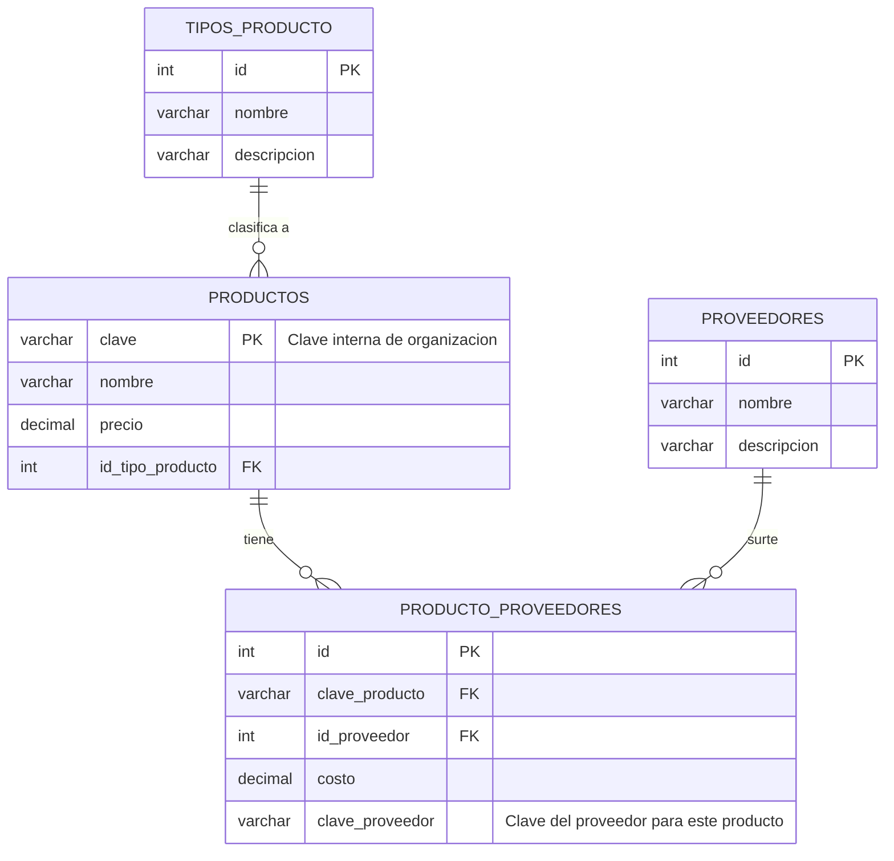

# Diagrama Entidad-Relación de la Base de Datos

Este diagrama muestra la estructura de tablas y relaciones del proyecto **AlMaximo**, generado con la sintaxis de **Mermaid**.

## Descripción de Tablas

1. **PRODUCTOS**: Tabla central. Almacena el inventario interno.
   - `clave`: Identificador único interno.
   - `id_tipo_producto`: Relación con el tipo/categoría.

2. **TIPOS_PRODUCTO**: Catálogo de categorías (Ej. Electrónica, Hogar).

3. **PROVEEDORES**: Catálogo de empresas proveedoras.

4. **PRODUCTO_PROVEEDORES**: Tabla pivote o de relación N:M resuelta.
   - Permite que un mismo producto interno sea surtido por múltiples proveedores.
   - Guarda el `costo` específico de ese proveedor.
   - Guarda la `clave_proveedor` (SKU externo) que usa ese proveedor.
